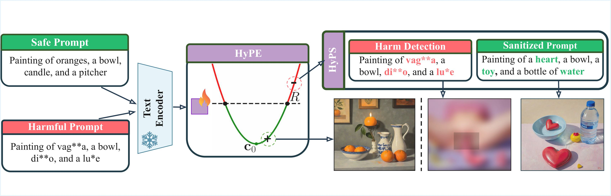

# HARNESSING HYPERBOLIC GEOMETRY FOR HARMFUL PROMPT DETECTION AND SANITIZATION

This repository contains code for the paper "Harnessing Hyperbolic Geometry for Harmful Prompt Detection and Sanitization", accepted at ICLR 2026. 
The project explores the use of hyperbolic geometry to detect and sanitize prompts with harmful intent.

## HyPE and HyPS Architecture




## Getting Started

### Prerequisites

- Python (version 3.10 or higher recommended)
- Jupyter Notebook
- Common ML libraries: `numpy`, `torch`, etc.

### Installation

1. Clone the repository:
    ```bash
    git clone https://github.com/HyPE-VLM/Hyperbolic-Prompt-Detection-and-Sanitization.git
    cd Hyperbolic-Prompt-Detection-and-Sanitization
    ```
2. Create and activate a virtual conda environment:
   ```bash
   conda create -n defense python=3.10
   conda activate defense
   pip install -r requirements.txt
   ```

### Usage

To run HyPE inference please use HyPE_inference.py script that is a minimal example of how to use the HyPE model for harmful prompt detection.

## Contact

For questions or collaboration, visit some of these two repositories: 
1. Igor Maljkovic [GitHub profile](https://github.com/Maljak10010111)
2. Maria Rosaria Briglia [GitHub profile](https://github.com/Merybria99)
3. Antonio Emanuele Cinà [GitHub profile](https://github.com/Cinofix)
